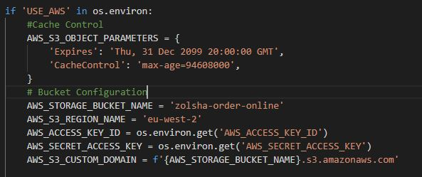

<h1>Zolsha Online Ordering</h1>

 
<h4><a href="https://github.com/elliemcavoy/zolsha-order-online" target="_blank">GitHub Link</a></h4>
<h4><a href="https://zolsha-order-online.herokuapp.com/" target="_blank">Deployed Project</a></h4> 

This is my Milestone 4 Project which aims to create a full stack web application using Django Frameworks in combination with HTML, CSS, Javascript & Python languages. The application provides an e-commerce app in the form of a food delivery site, including a payment system provided by Stripe. The app also features account creation & login functionality using Django AllAuth & a dining reservation system. There is also a dashboard specifically for the restaurant owners to allow them to monitor the current orders & reservations.
 

As this application is set up for testing purposs only, the Stripe payment system will require a test card to be entered at checkout. Please see below the details of the card to be used: 
Card Number: 4242 4242 4242 4242 
Expiry Date: Any expiry date 
CVV: Any CVV 
As this is a US card number, you will need to enter a ZIP code at checkout instead of a postcode so please enter any 5 numbers.

As this restaurant only caters for a specfic geographical area, the postcodes that the 'Calculate Delivery' functionality will accept begin with the following: 
BD20 
BD21 
BD22 
BD23 
Any other postcodes will advise delivery is not possible so if you would like to test this functionality please use one of the above postcode prefixes.

If you wish to test the discount code functionality, currently the only offer code set up is 10OFF and this can be entered at the checkout for 10% off the order.

An admin user has been set up to access the Restaurant Dashboard & login details have been provided in the Project Submission form for security reasons.

<h2>Table of Contents</h2>
<ol>
<li><a href="#ux">UX</a></li>
<ul>
<li><a href="#wireframes">Wireframes</a></li>
<li><a href="#target-audience">Target Audience</a></li>
<li><a href="#user-stories">User Stories</a></li>
<li><a href="#design">Design</a></li>
<ul>
<li><a href="defensive-design">Defensive Design</a></li>
<li><a href="typography">Typography</a></li>
</ul>
</ul>
<li><a href="#database">Database</a></li>
<li><a href="#features">Features</a></li>
<ul>
<li><a href="#existing-features">Existing Features</a></li>
<li><a href="#new-features">Features left to implement</a></li>
</ul>
<li><a href="#technologies">Technologies Used</a></li>
<li><a href="#testing">Testing</a></li>
<li><a href="#deployment">Deployment</a></li>
<li><a href="#credits">Credits</a></li>
</ol>

<h1 id="ux"><u>UX</u></h1>
This websites primary purpose is to allow Zolsha Restaurant & Takeaway's customers to order their favourite dishes from the comfort of their own homes and to have the food either delivered or to allow them to collect the food once it is ready. The functionality is as such that the customers can provide all the relevant details to allow for the food to be delivered and make a secure payment for the order. A website search function will provide any users the ability to search for menu items by a keyword to save them time if they know what they would like to purchase. The ordering system will be available for any visitors to the site however delivery will only be available for customers within a certain distance from the restaurant. Additional functionality will be made available for user's that register on the site such as a profile that stores all previous orders and delivery information to save time for regular customers when ordering.
The website will also have a secondary purpose which is to allow customers to make table reservations for dining in at the restaurant. The user can check availability and if a table is available a booking can be made. Again, a registered user will have the additional functionality to view all of their table reservations in their profile.
The third and final purpose of this website will be to allow the restaurant ovwners and employees to keep up to date with orders and reservations for that day by providing them with a dashboard showing these in a easy to read format. It will also allow them to keep their menu up to date by offering them the opportunity to add new dishes to the menu.
 

<h2 id="wireframes">Wireframes</h2>
Please see the wireframes for this project: 
<a href="media/readme/desktop-wireframe.png" target="_blank">Desktop</a> 
<a href="media/readme/mobile-wireframe.png" target="_blank">Mobile</a> 

<h2 id="target-audience">Target Audience</h2>
<ul>
<li>The target audience for this website has a relatively narrow scope. As this is primarily a tool for ordering a food delivery, the target audience will live within a small geographical area surrrounding the restaurant. As delivery is limited to a number of postcodes and customer will not be willing to travel too far to visit the restaurant, I have estimated that the target audience will be based within 7 miles of the restaurant.</li>
<li>The demographic for the consumer audience will be Indian food lovers, aged over 16. </li>
<li>There will also be a secondary audience which is the restaurant owner/employees to allow them to keep up to date with orders and bookings the restaurant has recieved. </li>
</ul> 

<h2 id="user-stories">User Stories</h2>
As a user of the website, the following actions and results would need to be achieved:
<ul>
<li>Unregistered User</li>
<strong>As an unregistered user, I would like to be able to:</strong>
<ol>

<li>Browse the menu items and filter by categories.</li>
<li>Add items to my shopping bag.</li>
<li>Search for a specific dish or ingredient without having to browse through all menu items.</li>
<li>See a summary of the items in my shopping bag and an order total each time I add a new item without having to visit the shopping bag each time.</li>
<li>Calculate the delivery fee by providing my postcode. </li>
<li>Review my shopping bag details before completing the checkout process and make any amendments should they be required. </li>
<li>Provide delivery & contact details before providing payment for my order.</li>
<li>View a confirmation of the items I have ordered & the order number.</li>
<li>Have the option to register for an account by providing an email and creating a password & username.</li>
<li>Check availability for a table in the restaurant on a given date and make a dining reservation. </li>
</ol>
<li>Registered User</li>
<strong>As a registered user, I would like to be able to do all of the above actions (for an unregsitered user) and:</strong>
<ol>
<li>Save my delivery details to my profile which will then be automatically entered at the checkout.</li>
<li>View my previous order details including the items ordered in my profile </li>
<li>Reorder previous orders directly from the order history without having to search through the menu to find each item.</li>
<li>View any table reservations I have made including the reservation details, such as the date & time, in my profile</li>
<li>Have the ability to cancel any table reservations I have made directly from my profile without having to contact the restaurant directly. </li>
</ol>
<li>Admin/Super User</li>
<strong>As the admin/super user, I would like to be able to:</strong>
<ol>
<li>Add new dishes/items to the menu. </li>
<li>View all of the current days orders including the postcode and price.</li>
<li>View all of the current days table reservations in details with the time and number of people shown.</li>
</ol>
</ul> 

<h2 id="design"><u>Design</u></h2>
I have kept the design of the webpages simple and easy to navigate.
<ul><li>All of the headings are the same size, colour & font and the colour scheme is the same throughout.</li>
<li>Also all of the buttons have the same colour schemes including when they are hovered over.</li>
<li>The forms displaying data to the user have the same styling throughout the site so the the user is able to locate a form easily should they need to reference back to the items in their order.</li>
<li>All input forms that require details from the user, are displayed in the card component from Bootstrap. These all have the same grey styling to make it easy for users to locate the sections that require their input.</li>
<li>The background for each page is dependant on the content. For the menu and profile sections, the background is vector images such as the restaurant logo and food items. The pages relating to the restaurant dining have a black & white photograph style image of the restaurant. This shows a divide between the online ordering for takeaways & then the restaurant features.</li>
</ul>

<h2 id="defensive-design">Defensive Design & Security</h2>
<h4>Security</h4>
<ul>
<li>To ensure all passwords, secure URL's and API keys remain secure, these have all been set to be retrieved using os from the environment. In Gitpod, these are set as environment variables & then when deployed with Heroku, they are set as 'Config Variables'. This means that they will never appear in Git version control.</li>
<li>To ensure the security of user's details, I have used Django's AllAuth to handle all of the user admin. This will ensure the user passwords are hashed and stored securely. Django AllAuth will also added the added level of security when a user is creating an account by asking them to verify their email address before they can log into their account.</li>
</ul>
<h4>Defensive Design</h4>

I have added some features to ensure unauthorised users cannot access pages outside their scope.

<ul>
<li>For the restaurant admin page, I have ensured that only a superuser can access this page. Should a user who is not logged in, try and access this by adding 'profile/restaurant-admin' to the end of their url, they will be redirected to the sign in page. Once signed in, is a user again tries to access this url, they will be redirected back to the homepage and a toast message appears advising them that only restaurant users can do that. 
</li>
<li>The same has been added to the 'add menu item' view to ensure that someone who is not a super user cannot just type in the url and add items to the menu. This is very important as if a user was able to access this, they could add menu items with very low prices and then complete an order.</li>
<li>I have also added a custom 404 error page which will replace the generic 404 page. The design follows that of the website as a whole and contains a link for users to return to the homepage.</li>
</ul>

<h2 id="typography">Typography</h2>

2 Google Fonts were used in this project:

<ol>
<li>Montserrat Subrayada - used for all headings & card headers</li>
<li>Short Stack - used for all body text.</li>
</ol> 

<h1 id="database"><u>Database</u></h1>
For this website, there will be a schema of interconnecting models. The tables below show the items in each of the models and the Foreign keys connecting them to each other. 

<h3><u>Users</u></h3>

This model was installed with the help of Django AllAuth to allow users to register and then sign in to their accounts. 

| Key                | Value          |  Data Type       |
|--------------------|----------------|------------------|
|username| Username decided by user| Varchar/Integer |
|password| Password chosen by user that has been hashed| Varchar/Integer |
|first name| Users first name | Varchar |
|last name| Users last name | Varchar |
|email address | Users email address | Email |
|date joined | The date the user registered | Date/Time |

 
<h3><u>Menu App</u></h3> 
<h4><u>Category</u></h4>

| Key                | Value          |  Data Type       |
|--------------------|----------------|------------------|
|_id | Id (automatically generated to be unique & sequential)| ID |
|name| category name| Text |
|friendly name| An easier to understand name that can be displayed to users| Text |

 
<h4><u>Subcategory</u></h4>

| Key                | Value          |  Data Type       |
|--------------------|----------------|------------------|
|_id | Id (automatically generated to be unique & sequential)| ID |
|name| subcategory name| Text |
|friendly_name| An easier to understand name that can be displayed to users| Text |
|category| Foreign Key to link each subcategory to the relevant category | Foreign Key |

 
<h4><u>Menu</u></h4>

| Key                | Value          |  Data Type       |
|--------------------|----------------|------------------|
|_id | Id (automatically generated to be unique & sequential)| ID |
|sku| Unique combination of letters and numbers to each menu item | Varchar |
|name| The name of the menu item | Text |
|description| A description of the menu item  | Text |
|price| Price of each item to 2 decimal places  | Numbers - float 2 |
|has_options| Whether the item has different options able to be selected | Boolean |
|category| Foreign Key to link each menu item to the relevant category | Foreign Key |
|subcategory| Foreign Key to link each menu item to the relevant subcategory | Foreign Key |

 
<h3><u>Bag App</u></h3> 
<h4><u>Delivery Charges</u></h4>

| Key                | Value          |  Data Type       |
|--------------------|----------------|------------------|
|_id | Id (automatically generated to be unique & sequential)| ID |
|area| The postcode prefix for each area| Varchar (max 4) |
|charge| The cost of delivery to the area | Number - float 2 |

 
<h3><u>Checkout App</u></h3> 
<h4><u>Order</u></h4>

| Key                | Value          |  Data Type       |
|--------------------|----------------|------------------|
|_id | Id (automatically generated to be unique & sequential)| ID |
|order_number| Unique order number for each order | Varchar (max 32) |
|user_profile| Foreign Key to link order to user profile | Foreign Key |
|full_name | Customers full name | Text |
|email | Customers email | Email |
|phone_number | Customers phone number  | Number |
|postcode | Customers delivery postcode  | Varchar (7) |
|town_or_city | Customers delivery town  | Text |
|street_address1 | Customers delivery address line 1  | Varchar |
|street_address2 | Customers delivery address line 2  | Varchar |
|order_date | Order date for this order  | Date/Time |
|order_time | Order time for this order  | Date/Time |
|delivery_details | Any additional information provided by customer for delivery driver  | Text |
|delivery_cost | Price of delivery  | Decimal - float 2 |
|order_total | Price of all ordered items  | Decimal - float 2 |
|grand_total | Price of all ordered items plus delivery charge  | Decimal - float 2 |
|original_bag | Summary of the shoppping bag  | Text |
|stripe_pid | Stripe Payment ID  | Varchar |
 

<h4><u>Order Line Item</u></h4>

| Key                | Value          |  Data Type       |
|--------------------|----------------|------------------|
|_id | Id (automatically generated to be unique & sequential)| ID |
|order | Foreign Key to link the order line items to a specific order | Foreign Key |
|item | Foreign Key to link this line item to the related item in the Menu model | Foreign Key |
|item_option | If the item has options, the option selected will be stored | Text |
|quantity | The quantity of the item that was in the shopping bag | Integer |
|lineitem_total | The item price multiplied by the quantity | Decimal - float 2 |

 
<h4><u>Offer</u></h4>

| Key                | Value          |  Data Type       |
|--------------------|----------------|------------------|
|_id | Id (automatically generated to be unique & sequential)| ID |
|offer_code | Offer code that customers can be given to gain a discount | Varchar |
|discount | Percentage discount provided by the offer code | Number |

 
<h3><u>Reservations App</u></h3> 
<h4><u>Reservation</u></h4>

| Key                | Value          |  Data Type       |
|--------------------|----------------|------------------|
|_id | Id (automatically generated to be unique & sequential)| ID |
|res_number | Randomly generated reservation number unique to each booking | Varchar |
|date | Reservation date | Date/Time |
|time | Reservation time | Date/Time |
|covers | Number of Guests | Number |
|full_name | Name of lead guest | Text |
|email | Email address for lead guest | Email |
|phone_number | Phone number for lead guest | Number |
|user_profile | Links reservation to User's profile if registered | Foreign Key |
 

<h3><u>Profiles App</u></h3> 
<h4><u>User Profile</u></h4>

| Key                | Value          |  Data Type       |
|--------------------|----------------|------------------|
|user | User that was created by Django AllAuth | Foreign Key |
|defualt_name| Preferred name for user | Text |
|default_phone_number| Preferred phone number | Number |
|default_street_address1| Delivery address line 1 | Varchar |
|default_street_address2| Delivery address line 2 | Varchar |
|default_town_or_city | Delivery town or city | Text |
|default_postcode | Delivery postcode | Varchar |

 
<h3>Database Design</h3>
See below a diagram for the flow of data through the different database models in this project. 

<h2 id="existing-features"><u>Existing Features</u></h2>
<ol>
<li>NAVIGATION</li>
<li>VIEW MENU ITEMS</li>
<li>SEARCH MENU ITEMS</li>
<li>FILTER MENU ITEMS BY CATEGORY/SUBCATEGORY</li>
<li>ADD ITEMS TO SHOPPING BASKET</li>
<li>CALCULATE DELIVERY CHARGE</li>
<li>EDIT & REMOVE ITEMS IN SHOPPING BASKET</li>
<li>ADD PROMOTIONAL CODES TO GAIN DISCOUNT</li>
<li>SECURE CHECKOUT</li>
<li>REGISTRATION</li>
<li>LOGIN</li>
<li>LOGOUT</li>
<li>USER PROFILE</li>
<li>CHECK DINING AVAILABILITY</li>
<li>COMPLETE DINING RESERVATION</li>
<li>CANCEL DINING RESERVATION</li>
<li>RESTAURANT DASHBOARD</li>
</ol>
 
<h2 id="new-features"><u>Features Left to Implement</u></h2>

<ol>
<li>Automatically delete and remove past date dining reservations from the database and therefore from the user profile as well.</li>
<li>Create an 'address book' of the restaurants customers who have previously ordered or booked a table and only give access to the admin user.</li>
<li>Add additional functionality to the Restaurant Dashboard to allow the restaurant owner to contact customers by email directly from the dashboard.</li>
<li>Add an additional view to the user profile to allow the user to amend their dining reservation directly from their profile.</li>
<li>Use further functionality from Django AllAuth to enable users to sign up/log in using their social media accounts such as Facebook.</li>
<li>Provide functionality to the restaurant owner to remove items from the menu for a specified period of time in case of stock shortages. This will allow them to temporarily remove an item should they not have the ingredients to make it, but mean they don't then have to re-add the item when they are able to offer this item again.</li>
</ol>

<h1 id="technologies"><u>Technologies Used</u></h1>

<h3>Languages Used</h3>
<ul>
<li>HTML5</li>
<ul><li>HTML5 has been used to create the core content and base structure for each page.</li></ul>
<li>CSS3 </li>
<ul><li>CSS3 was used to style the HTML elements and create a responsive design.</li></ul>
<li>JavaScript</li>
<ul><li>Javascript was used on numerous elements to make them responsive to user input. For example, to sort & order menu items dependant on the users desired output.</li></ul>
<li>Python3</li>
<ul><li>Python was used to create all of the backend functionality of the web application.</li></ul>
</ul>
<h3>Django & Django Extensions Used</h3>
<ul>
<li>Django Framework</li>
<ul><li>Django has been used to create the whole project. The framework has provided a base for all apps that make up the web application.</li></ul>
<li>Django AllAuth</li>
<ul><li>This was used to create the sign up & sign in functionality of the application. Essentially, Django AllAuth provides the functionality to create a user for the site.</li></ul>
<li>Django Crispy Forms</li>
<ul><li>All forms were created using the crispy form framework to allow for standardisation throughtout the project.</li></ul>
</ul>
<h3>Libraries & Frameworks Used</h3>
<ul>
<li><a href="https://getbootstrap.com/" target="_blank">Bootstrap</a> - Used to provide page structure, Navbar design and form components. Also used to provide generic styling using Bootstrap classes. </li>
<li><a href="https://jquery.com/" target="_blank">JQuery</a> - Used to simplify the javascript written in this project & used to activate some of the components provided by bootstrap i.e the toasts</li>
<li><a href="https://stripe.com/gb" target="_blank">Stripe</a> - Used to implement the payment system for completing orders. The payment form element was also provided by Stripe.</li>
<li><a href="https://fontawesome.com/" target="_blank">Font Awesome</a>  - Icons for forms and styling.</li>
<li><a href="https://fonts.google.com/" target="_blank">Google Fonts</a> - Used to create a look in keeping with the website aim and to create uniform styling throughout.</li>
<li><a href="https://balsamiq.com/wireframes/" target="_blank">Balsamiq</a> - Used to create the wireframes for the desktop & mobile views.</li>
</ul>
<h3>Project Creation & Coding</h3>
<ul>
<li>GitHub</li>
<ul><li>GitHub was used to create the repository for storing all code aspects of this project.</li></ul>
<li>GitPod</li>
<ul><li>Gitpod was the platform used to create all of the files and content for my project.</li></ul>
<li>Git</li>
<ul><li>Git was used for version control.</li></ul>
</ul>
<h3>Database & Deployment</h3>
<ul>
<li>Heroku - Used to deploy the finished project.</li>
<li>GitHub - Connected Github repository to Heroku to allow for deployment.</li>
<li>Amazon Web Service - used to store static files & images.</li>
<li>Gunicorn - Used to deploy the project from Gitpod to Heroku. </li>
<li>Postgres Database - used to hold all models and database data for the deployed project.</li>
</ul>

</ul>

<h1 id="testing"><u>Testing</u></h1>
<h4>Validators</h4>
<ul>
<li>W3C HTML Validator</li>
All pages of HTML content have been checked by the HTML validator and have passed on the HTML elements however there were errors advised as the validator does not recognise the Django templating within the HTML documents.
<li>W3C CSS Validator</li>
The CSS has been passed through the validator & passed.

<li>PEP8 Compliant</li>
I used Gitpod to detect an problems with the Python code such as trailing whitespace & lines of code that were over the character limit to be PEP8 compliant. I then passed the code through the PEP8 Online validator.

</ul>

<h4>Manual Testing</h4>
I have carried out a lot of manual testing on different aspects of this project. Please see detailed manual testing logs <a href="testing.md"> here </a>.
Please see below a brief overview of the testing carried out. Any issues found and fixes put in place are documented in the testing log.

| Page                  | Bug Detected   | Bug fixed Y/N |
|---------------------- |----------------| --------------|
| Home Page (user)    | No issues found| 
| Home Page (user logged in)  | No issues found| 
| Register Page (user)  | No issues found| 
| Log In Page (user)  | No issues found| 
| Log In Page (admin user)  | No issues found |
| Menu (user)  | ISSUE FOUND | Y
| Shopping Bag (user) | ISSUE FOUND    | Y
| Checkout Page (user) | ISSUE FOUND     | Y
| Checkout Page (user logged in) | ISSUE FOUND     | Y
| Order Success (user) | No issues found     | 
| Check Dining Availability (user) | No issues found     | 
| Make Dining Reservation (user) |ISSUE FOUND   | Y (but further improvements could be made)
| Make Dining Reservation (user logged in) | ISSUE FOUND  | Y (but further improvements could be made)
| User Profile | No issues found     | 
| Reorder previous orders (user logged in) | No issues found     | 
| Cancel Dining Reservation | No issues found    |
| Restaurant Dashboard (admin user) | No issues found    |
| Add New Recipe (admin user) | No issues found    | 

<h1 id="deployment"><u>Deployment</u></h1>
This project has been deployed via Heroku and can be accessed <a href="https://zolsha-order-online.herokuapp.com/" target="_blank">here</a> . 
If you would like to deploy the project for yourself, the steps I took to set up my project ready for deployment & to finally deploy when completed are shown below:

<h4>GitHub, Gitpod & Git</h4>
<ul>
<li>The repository for this project was created in Github & I used the Code Institute Gitpod Full Template which can be found <a href="https://github.com/Code-Institute-Org/gitpod-full-template" target="_blank">here.</a> I then clicked the 'Use Template' button and created my repository with the name zolsha-online-ordering. You are required to be logged into your GitHub account to be able to view the 'Use Template' button. </li>
<li>Once the repository had been successfully created in GitHub I was able to redirect to Gitpod directly using the 'Gitpod' button.</li>
<li>Throughout the project, I used Gitpod to create all the folders & files to hold all my code. </li>
<li>I used Git to add any changes to version control in GitHub. As I used the Code Institute template, my Git branch was already set up and so to commit any changes I just followed the below process:
<ul>
<li><b>git status</b> (this gives a list of all modified or untracked files).</li>
<li><b>git add .</b> (adds all modified/untracked files to commit staging area) or <b>git add [filename]</b> (adds only specified file to commit staging area).</li>
<li><b>git commit -m "commit message"</b> (the commit message explains the changes made).</li>
<li><b>git push</b> (this will push the changes up to GitHub).</li>
</ul></li>
</ul>

<h4>Setting up Heroku & Postgres</h4>
<ul>
<li>I logged into my Heroku account however if you do not have an account you can sign up <a href="https://signup.heroku.com/" target="_blank">here</a>.</li>
<li>Once signed in, I created a new app ensuring to select the region closest to my location i.e. Europe.</li>
<li>With the app created, I selected the 'Resources' tab and searched for 'Postgres' which will create a Postgres database for this project. I just selected the FREE plan for use with this project.</li>
<li>To use Postgres with my project, there are two installations that are required. I installed these in the gitpod terminal with the following commands:</li>
<ul>
<li><b>pip3 install dj_database_url</b></li>
<li><b>pip3 install psychopg2-binary</b></li>
</ul>
<li>As new installation had been made, I updated my requirements.txt file which advises Heroku the installations it needs to make in order to run the app. The update this file I typed the following in the Gitpod terminal: <b>pip3 freeze > requirements.txt</b></li>
<li>To ensure that the project is set up to use Postgres when the project is deployed, I changed a few sections in the settings.py file of zolsha_ordering. </li>
<li>Firstly at the top of the file, I added the following:<b> import dj_database_ur</b></li>
<li>Then to ensure all of the migrations are completed for Postgres as well as the SQLite database used in development, I commented out the current database settings.</li>
<li>I then added the below to the database setting: 
<b>DATABASES = { 
        'default': dj_database_url.parse('DATABASE_URL') 
    }</b> 
    The DATABASE_URL can be found in Heroku under the settings section. If you 'Reveal Config Variables' the DATABASE_URL is displayed there. This can be copied and entered into the settings as above. However this should not be added to version control as this is an environment variable and will eventually be gained from the Heroku Config Variables when deployed. But for setting up the Postgres database this can be entered directly into the settings.</li>
<li>Once these settings are updated, I need to migrate all of the migrations using the following command: 
<b>python3 manage.py migrate</b></li>
<li>I also need to load all of the pre-set data into the Postgres database such as the categories, sub-categories and menu items. To do this I entered the following commands into the terminal: 
<b>python3 manage.py loaddata categories 
python3 manage.py loaddata subcategories 
python3 manage.py loaddata menu </b></li>
<li>I also needed to recreate the superuser with the following commmand: 
<b>python3 manage.py createsuperuser</b></li>
<li>Once all of these changes had been made, I removed the DATABASE_URL from the settings so I did not end up in version control and commited the changes.</li>
<li>I then implemented an if statement in the settings.py under the DATABASE section. This will ensure that during development the SQLite database setting are used and when deployed, the Postgres database setting will be used.</li>
<li>The following if statement was added: 
<b>if 'DATABASE_URL' in os.environ: 
    DATABASES = { 
        'default': dj_database_url.parse(os.environ.get('DATABASE_URL')) 
    } 
else: 
    DATABASES = { 
        'default': { 
            'ENGINE': 'django.db.backends.sqlite3', 
            'NAME': os.path.join(BASE_DIR, 'db.sqlite3'), 
        } 
    }</b>
</li>
<li>This will ensure that the DATABASE_URL environment variable is retrieved from Heroku and not stored in version control.</li>
<li>The Postgres database is now set up and ready to use for deployment.</li>
</ul>

<h4>Gunicorn & Procfile</h4>
<ul>
<li>I order for the app to be deployed correctly to Heroku I needed to install Gunicorn.</li>
<li>To do this I entered the command below into the terminal: 
<b>pip3 install gunicorn</b></li>
<li>This will need adding to the requirements.txt file using the following command: 
<b>pip3 install gunicorn</b></li>
<li>Heroku also requires a Procfile to know how to run the application. </li>
<li>To create a Procfile in the workspace I entered the following into the terminal: 
<b>touch Procfile</b></li>
<li>The following is then added to the Procfile: 
<b>web: gunicorn zolsha_ordering.wsgi:application</b> 
The 'zolsha_ordering' is the name of the app in which the settings are located.</li>
</ul>

<h4>Deploying to Heroku</h4>
<ul>
<li>Firstly, I logged into Heroku in the command line using: <b>heroku login -i</b></li>
<li>I then disabled the static files being deployed until I had set up my AWS bucket using the following: <b>heroku config:set DISABLE_COLLECTSTATIC=1 --app zolsha-order-online</b> </li>
<li>I then added Heroku to the allowed hosts in my settings.py using the following: <b>ALLOWED_HOSTS = ["zolsha-order-online.herokuapp.com", "localhost"]</b> This will also allow the host to be the local hosting environment too.</li>
<li>Ater pushing the changes to my Github repository, I then set up to push to Heroku as well using the following command in the terminal: <b> heroku git:remote -a zolsha-order-online</b></li>
<li>Finally, I used the following command to push everything up to Heroku: <b>git push heroku main</b>  which will allow Heroku to deploy the project.</li>
<li>I also connected to my Github repository from Heroku & set up 'Automatic Deployments' so that everytime I push to Github, the project is deployed by Heroku.</li>
</ul>

<h4>Amazon Web Services (AWS)</h4>
<ul>
<li>Firstly, I created an AWS account by following the sign up steps & providing all the relevant details. This will be used to host my static files.</li>
<li>Once my account was created, I searched for S3 which is the cloud based storage and created a bucket. I gave the bucket the same name as my Heroku app to keep everything consistent. I then selected the region that was closest to my location. I also disabled the 'block public access' as I will need everyone to be able to access the static files in order to view the website.</li>
<li>I then made the following change to the properties for the bucket. I enabled static web hosting and entered a generic index.html and error.html in the relevant feilds as these are not required for our use of S3. </li>
<li>Then I made the following changes to the permissions. In the CORS section, I entered the following: 
<b>[ 
    { 
        "AllowedHeaders": [ 
            "Authorization" 
        ], 
        "AllowedMethods": [ 
            "GET" 
        ], 
        "AllowedOrigins": [ 
            "*" 
        ], 
        "ExposeHeaders": [] 
    } 
]  </b>
I then clicked on 'edit' on the Bucket Policy section (you will need to copy the ARN from this page) & then followed the link to generate a policy. I selected 'S3 Policy' from the dropdown and added a * into the Principal field to ensure all were selected. Then the action I selected from the dropdown was 'get object'. I then entered my ARN from the previous page and clicked 'Add Statement' followed by the 'Generate Policy' button. Once the policy has been generated, I copied it and pasted into the Bucket Policy section. I made sure to add /* on to the end of the resource line. Finally, I edited the 'Access Control List' to allow everyone to access the list permission.</li>
<li>I then needed to create a user for the bucket. To do this I used another section of AWS called IAM. I searched for this in AWS and started by creating a group for my user to be placed in. I clicked the 'Create Group' option and named the group a relatable name compared to my bucket.</li>
<li>With the group created, I then needed to assign a policy to it. To do this, I accessed the policy section of the group and then clicked 'Create Policy'. Using the JSON tab, I then imported managed policies, searched for S3 and selected the AmazonS3FullAccess and imported this. Once this was imported I added my ARN to the resources section and added a second line with the /* at the end as well. I then reviewed the details, provided a name & description for the policy & finally generated it.</li>
<li>In the group's permission section, I then attached the policy I had created by finding it in the list using the name I had given it.</li>
<li>I was then able to create a user, giving the user a name & programmatic access. Finally I selected the group the user would be added to i.e. the group I had just created and clicked 'Create User'.</li>
<li>This generated the user keys which are needed for Heroku to access the bucket. I downloaded the CSV file as these user keys are important and the file can only be downloaded at this point.</li>
<li>Back in Gitpod, I then installed two packages to allow Django to connect to AWS. Please see the following commands entered below: 
<b>pip3 install boto3 
pip3 install django-storages</b></li>
<li>These were then frozen to the requirements.txt file as we have done previously. I also added storages to the list of installed apps in the settings.py file.</li>
<li>In Heroku, I then set up a new Config Var : USE_AWS and set the value to True</li>
<li>In settings.py I then added an if statement to check if there is a variable 'USE_AWS' and if so use AWS for static storage. Please see below: 
</li>
<li>I then set up the custom_storages.py file to advise Heroku we want to use AWS for storage. Firstly I imported settings from django.conf and then S3Boto3Storage from storages.backends.s3boto3. The following classes were added to the custom_storages.py file: 
 </li>
<li>I was then able to push everything to Github & Heroku and the project was fully deployed on Heroku.</li>
</ul>

<h4>Local Set Up</h4>
If you want to set this project up locally rather than deploying to a hosting site, please see below the steps to take.
<ul>
<li>You will first need to download or clone a copy of the code that is provided in my Github repository - please see above for the Github link. You can do this by clicking the 'code' dropdown on Github and either download the zip file and then upload to your own repository or you can use the following command in your own workspace: <b>git clone https://github.com/elliemcavoy/zolsha-order-online.git</b>
</li>
<li>Once you have all of the code files in your workspace, use the following command to download all of the required packages to run: <b>pip3 install -r requirements.txt</b></li>
<li>You will then need to enter your environment variables into your workspace. These easiest way to do this to avoid having to enter them each time you restart your workspace is via the settings section of your Gitpod (or whichever development tool you are using). The following environment variables are required: 
<ul>
<li>SECRET_KEY = your django secret key which you can generate using the following link: <a href="https://djecrety.ir/" target="_blank">Django secret key generator</a></li>
<li>STRIPE_PUBLIC_KEY = your Stripe public key (you will need to create an account at: <a href="https://stripe.com/gb">Stripe</a></li>
<li>STRIPE_SECRET_KEY = your Stripe secret key from your Stripe Account</li>
<li>STRIPE_WH_SECRET = your Stripe webhook secret key</li>
<li>IN_DEVELOPMENT = True</li>

</ul></li>
<li>As you are setting up a new Django app, you will need to migrate all of the models to the database. In order to do this follow the below steps and enter these commands into your terminal: 
<ul>
<li><b>python3 manage.py makemigrations --dry-run</b></li>
<li><b>python3 manage.py makemigrations</b></li>
<li><b>python3 manage.py migrate --plan</b></li>
<li><b>python3 manage.py migrate</b></li>
</ul>
The --dry-run and --plan flags will just display the planned actions so you can ensure there are no migrations that are not correct.</li>
<li>You will then need to create a super user to enable you to access the models & database items. To do this just enter the following into the terminal: 
<b>python3 manage.py createsuperuser</b> 
and follow the on screen prompts to set up your super user.</li>
<li>You will also need to load the fixtures data to ensure the filtering, searching & adding items work correctly. To do this enter the below into your terminal: 
<b>python3 manage.py loaddata categories</b> 
<b>python3 manage.py loaddata subcategories</b> 
<b>python3 manage.py loaddata menu</b> 
Ensure you enter these in the above order as the subcategories & menu data require the categories data to upload.
</li>
<li>You are now ready to start running the website in the local host so you will just need to enter: <b>python3 manage.py runserver</b> in the terminal and open the exposed port in a separate browser window.</li>
</ul>

<h1 id="#credits">Credits</h1>

<h3>Design</h3>
<ul>
<li>The following elements and components have been taken from Bootstrap including the Jquery (when required) to operate them successfully:</li>
<ul>
<li>Navbar & Side Navbar</li>
<li>Card Component for all menu items, availability section & order history.</li>
<li>Toast component for messages section.</li>
<li>Date & time selectors for dining availability.</li>
</ul>
<li>Bootstrap classes have also been used for styling the components.</li>
<li>Google Fonts utilized for all font styles within the project.</li>
<li>Font Awesome used for all icons throughout the project.</li></ul>

<h3>Code</h3>
<ul>
<li><a href="https://docs.djangoproject.com/en/4.0/" target="_blank">Django Documentation</a>- used to help implement AllAuth and also assisted with issues relating to Django such as correct settings to be applied in settings.py.</li>
<li><a href="https://timepicker.co/" target="_blank">Timepicker.co</a> - used to implement the date & time picker elements in the correct format.</li>
<li><a href="https://stripe.com/docs/development" target="_blank">Stripe Documentation</a> - used to implement the payment system including the javascript to submit the payment form.  </li>
<li><a href="https://www.w3schools.com/python/python_while_loops.asp">W3Schools</a> - used to help implement the while loop for the delivery charge functionality in contexts.py.</li>
<li><a href="https://www.etemkeskin.com/index.php/2020/12/28/creating-custom-404-page-in-python-django/">404 Page</a> - used to add a 404 error page to replace the standard error page.</li>
<li><a href="https://stackoverflow.com/questions/14249998/jquery-back-to-top">Back to top button</a> - used to implement the back to top button on the menu items.</li>
<li>Tutor Support assisted with bug fixes on elements of the project such as webhook errors & filtering issues. Please see the testing documentation for further details on the assistance received. </li>
<li>Code Institute Tutorials were used for reference when creating functions & deploying to Heroku.</li>
<li>Boutique Ado Mini Project was used as reference for this project as some of the functionality required for this project was similar to that created in the mini project. </li>
</ul>

<h3>Media</h3>
<ul>
<li>Font Awesome used for all icons and symbols.
</li>
<li>All photograph images were provided by Zolsha Restaurant.</li>
<li>Image to show responsive design from <a href="http://ami.responsivedesign.is/#" target="_blank">http://ami.responsivedesign.is/#</a></li></ul>