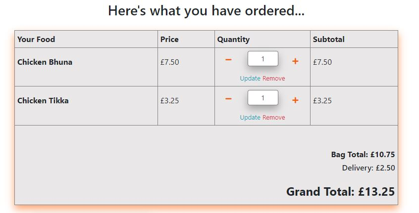
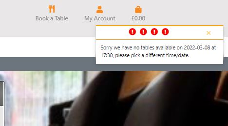

<h1>Manual Testing</h1>

<h2>Manual Testing of User Stories</h2>
<ol>
<li><b>Browse the menu items and filter by categories.</b></li> 

<ul>
<li>From the homepage, it is easy to see, on both mobile and desktop views, how to start browsing for food items. There is an 'Order Now' button displayed over the hero image which takes the user to the full menu.
 
</li>
<li>There is also a secondary navigation bar (which is collapsed on mobile screens) which displays all four of the categories that would make it easy for users to just browse a specific food type such as 'starters'. Upon clicking on the category, a further menu appears which gives the user an even more detailed list of subcategories to make it even easier to browse their favourites.
</li>
<li>Once a subcategory has been selected and the list of menu items filtered, further navigation buttons appear underneath the page header displaying the other subcategories in the particular category that was selected. So, for example, this will make it easy for a user to browse all of the different main courses without having to navigate through the secondary navigation bar again. This is especially important smaller screens as the navigation is hidden in a side navbar and so getting to each subcategory would be more time consuming via the main navigation as opposed to the buttons at the top of the page.
 </li>
</ul> 
<li><b>Add items to my shopping bag.</b>
</li> 

<ul>
<li>Once an item has been decided upon, it is very easy to add this to the shopping bag. For items that have different options which are: Vegetable, Chicken, Keema, Lamb & Fish, there is a dropdown menu to allow you to select one of the previously mentioned options.</li>
<li>The quantity of the item can then be adjusted accordingly and then clicking the 'Add to Bag' button will add the quantity and option selected to the shopping bag.</li>
 </li>
<li>A summary of the current bag and a message to advise the item and quantity that was just added then appears in the top right of the screen so the user can double check that they have added the correct item.</li>
 </li>
<li>By remaining on the same page, and just showing a summary of the order rather than redirecting the user to the bag, it means shopping can continue without interuption.</li>

</ul> 
<li><b>Search for a specific dish or ingredient without having to browse through all menu items.</b>
</li> 

<ul>
<li>A search bar is clearly visible in the navbar either with the text box showing (on larger screens) or just with a search icon (on smaller screens). Clicking on the search icon, drops down a search bar where the search terms can be entered.
 
 </li>
<li>By typing a keyword into the search bar and clicking 'Search' the menu items are filtered to match the keyword provided.</li>
<li>Both the item name and the description are taken into account so the keyword could be present in either.</li>

</ul> 
<li><b>See a summary of the items in my shopping bag and an order total each time I add a new item without having to visit the shopping bag each time.</b></li> 
<ul>
<li>As mentioned previously, once an item is added to the bag, a summary box appears in the top right hand corner which advises the quantity and the name of the item that has just been added to the bag.</li>
<li>This summary box also displays the total number of items currently in the bag and also a list of the name, quantity and price of all items in the shopping bag.</li>
<li>Finally, an order total is displayed and a link to take you directly to the checkout should you wish.
 </li>

</ul> 
<li><b>Calculate the delivery fee by providing my postcode.</b></li> 
<ul>
<li>The calculate delivery fee section appears in the 'Shopping Bag' and makes it clear that should the user wish to have their food delivered, they will need to enter their postcode to calculate the delivery cost.</li>
<li>Upon entering a postcode, there are two outcomes. Firstly, if the postcode is within the delivery area available, the charge associated with the postcode entered is automatically added to the 'delivery charge' section in the shopping bag and the grand total updated accordingly.
 </li>
<li>If the postcode is not within the delivery area, a warning message is displayed in the top right of the screen advising that the restaurant does not deliver to that postcode and the delivery fee remains at zero.
 </li>
</ul> 
<li><b>Review my shopping bag details before completing the checkout process and make any amendments should they be required. </b></li> 
<ul>
<li>When visiting the shopping bag, if there are items in the bag, they are shown here along with the quantity and the price.
 </li>
<li>The quantity is displayed with increase and decrease buttons allowing the user to change the quantity directly from the shopping basket. Once the update has been made, the order total is automatically updated to reflect the new quantity.
  </li>
<li>Once the quantity has been updated, a success message advising what has been modified appears in the top right hand corner of the screen to allow the users to doubel check they have made the correct amendment.
 </li>
<li>There is also a 'remove' option for each item in the current shopping bag. Clicking on this automatically removes the item from the shopping bag and updates the order total accordingly. Again, a message is displayed to the user to advise the item that has been removed. </li>
<li>There is also a final chance to review the order details on the checkout page before completing the payment.</li>

</ul> 
<li><b>Have the option to register for an account by providing an email and creating a password & username.</b></li> 
 
<ul>
</ul> 
<li><b>Check availability for a table in the restaurant on a given date and make a dining reservation. </b></li> 
<ul>
<li>The 'Book a Table' link is displayed in the main nav so is easily accessible from any page on the site.</li>
<li>Upon clicking on the link, the check availability page is displayed which requires an entry of a date and a time that the user would like to book for.
 </li>
<li>Upon clicking the 'check availability' button, there are two possible outcomes.</li>
<li>If there is no availability for the date and time, an error message is displayed in the top right hand corner of the screen advising to try a different date or time.
 </li>
<li>If there is availability for the date and time requested, the user is redirected to the booking form to provide their details</li>
<li>The booking form requires the users details which are pre-populated if the user is signed in and they have their details stored in their profile. The date & time are also pre-populated from the previous availability search.
 </li>
<li>Upon submitting the form, a confirmation is provided on screen showing the booking details. If the user is signed in at the time of booking, the reservation will also be saved to their profile and displayed in their reservations section.
 
</li>

</ul> 
<li><b>Save my delivery details to my profile which will then be automatically entered at the checkout.</b></li> 
<ul>
<li>When logged in, the profile can be accessed from any page as it is displayed in a dropdown in the navbar.</li>
<li>On the profile page, there is a form that can be used to add or update personal details. These are saved to the profile and if the user is logged in when completing an order, the address details will be pre-populated in the checkout form.</li>

</ul> 
<li><b>View my previous order details including the items ordered in my profile.</b></li> 

<ul>
<li>When visiting the 'Profile' page, any previous orders that were made while logged in are displayed in the order history section.</li>
<li>The order number, order price and the items ordered (including their quantity) are shown for each previous order.</li>

</ul> 
<li><b>Reorder previous orders directly from the order history without having to search through the menu to find each item.</b></li> 

<ul>
<li>In the order history section of the user profile, the previous orders are displayed with the item details and total price.</li>
<li>For each of the previous orders there is a 'reorder' button. Clicking this automatically adds the order items and the quantity of each to the current shopping bag.</li>
<li>A success message appears in the top right of the screen which also displays the current shopping basket details and total price.</li>
<li>Should the user wish to add additional items to their order, they can then do this is the usual way.</li>

</ul>
<li><b>View any table reservations I have made including the reservation details, such as the date & time, in my profile</b></li> 

<ul>
<li>Once logged in and on the 'My Profile' page, there are three sections. The final section is a display of any previous dining reservations.</li>
<li>The date, time and number of diners that the reservation was made for are all displayed for each reservation.</li>
<li>If the user has not made any dining reservations, there is a button which takes the user to the 'check availability' page so they can make a new reservation. </li>

</ul>
<li><b>Have the ability to cancel any table reservations I have made directly from my profile without having to contact the restaurant directly.</b></li> 

<ul>
<li>On the profile page, as well as all of the details of each reservation, there is a 'cancel' button displayed next to each reservation to allow the user to cancel the booking easily should they need to. </li>

</ul>
<li><b>Add new dishes/items to the menu. </b></li> 

<ul>
<li>This is only available to admin users as the link to add a new item is displayed on the Restaurant Dashborad page.</li>
<li>Upon logging in a the admin user & navigating to the Restaurant Dashboard, the 'Add Item' button is located in between the tables for todays orders & todays reservations.</li>
<li>Clicking the button redirects the admin user to the form that is required to be completed in order to add the item.</li>
<li>The admin user is then required to complete the following fields: Category, Subcategory, Name, SKU, Price. The Category & Subcategory fields are dropdowns to ensure the user only selects a valid category. </li>
<li>The Description field is option as some items do not require a description.</li>
<li>The 'Has Options' field is defaulted to 'No' however this can be changed to 'Yes' if required.</li>
<li>As long as the fields are filled out correctly, upon submitting the form, a success message is displayed and the admin user is redirected to the Restaurant Dashboard.</li>
</ul>
<li><b>View all of the current days orders including the postcode and price. </b></li> 

<ul>
<li>After logging in as the admin user & visiting the Restaurant Dashboard, if there are any orders that have been placed on the current date they are displayed in a table on this page.</li>
<li>The table displays the order time, order number, price & postcode for each order. </li>
<li>If there are no orders that have been made on the current date, there is just a message advising the user that there are no orders yet. </li>

</ul>
<li><b>View all of the current days table reservations in details with the time and number of people shown. </b></li> 

<ul>
<li>After logging in as the admin user & visiting the Restaurant Dashboard, if there are any reservations for dining in on the current date they are displayed in a table on this page.</li>
<li>The table shows the customer name, the time of the reservation & the number of people.</li>
<li>If there are no table reservation for the current date, there is a message advising the user that there are no reservations for today.</li>
</ul>
</ol>

<h2>Lighthouse</h2>
I have used Lighthouse to gain a performance score for this site. Please see below the results. 
 

<h2>Manual Testing of key aspects of the website</h2>
I manually tested the following to make sure they worked as designed:

<h3>Main Navbar & Secondary Navbar</h3>
<ul>
<li>The largescreen navbar contains the logo, the search bar for searching for certain menu items, the link to book a table, the link to access account links & the shopping bag link displaying the current total. All of the nav links have an icon & a description of their function.</li>
<li>When on a smaller screen, the logo is placed on top of the navigation links. The search bar has been moved into a dropdown that is only visible when the search icon is clicked. The link descriptions have also been shortened to ensure they are visible & not to long to cause problems with spacing.  </li>
<li>The secondary navbar displays the menu categories & allows users to filter the menu. On largescreens the secondary navbar in located underneath the main nav and is a full width row. The main categories are displayed & are links to the subcategories associated with each category. Upon clicking on each category, a further navigation dropdown appears with the subcategory links listed.</li>
<li>On smaller screens, the secondary nav has been moved into a sidenav which is accessed by the collapsible nav link. The link to this is located next to the logo on smaller screens. Upon clicking this, a dropdown menu of all the category links appears. Further dropdown menus appear displaying the subcategories when each category is clicked on. Only one st of subcategories is displayed at a time to avoid the nav overflowing the screen size.</li>

</ul>

<h3>Messages</h3>
Messages are displayed when a success or error message is needed to be displayed to the user in an eye-catching way. I have used the toast feature from Bootstrap to accomplish this. The toasts are located in the top right hand corner of the page and will appear when a message is required to be displayed. The toasts will display until the user closes the toast using the 'X' button. 
Messages are used for the following:
 
Success Messages
<ul>
<li>User successfully signed in</li>
<li>User successfully signed out</li>
<li>Item added to bag</li>
<li>Item quantity updated in shopping bag</li>
<li>Item removed from shopping bag</li>
<li>New item added to menu</li>
<li>Reorder completed from user profile</li>
</ul>
Error Messages
<ul>
<li>Invalid postcode entered</li>
<li>Invalid discount code</li>
<li>No availability for dining reservation</li>
</ul>

I have tested each function and the messages are displayed correctly for each with the success or error design.

<h3>Responsive Design</h3>
<ul>
<li>I have tested each page on all screen sizes to ensure the design is consistent no matter what device it is being viewed on.</li>
<li>The navbar, as mentioned above, will adapt depending on the screen size to include a collapsible navbar on smaller screens.</li>
<li>Cards are used for the menu items and for all of the main form elements to keep the design consistent.</li>
<li>The card for the menu items take up 11 columns on smaller screens and 10 on medium & larger screen. Both are aligned to the center of the screen. This means the styling is the same no matter what screen size and the details are easy to read. With the menu items card on larger & medium screens, the description, quantity input & 'add to bag' button are all displayed inline within a row so the user can view all of the details from left to right. However on smaller screens, the items all occupy 12 columns each and so are displayed on top of each other to make sure the items are still visible & not cropped or missing. This is also a more mobile friendly way of displaying the card body details and takes a similar layout to other mobile/tablet food ordering systems.</li>
<li>The cards used to contain the forms are again responsive and will increase to fill the screen on smaller screen and then fit into a smaller number of columns of medium & larger screens depending on the other items on the page. For example, on the Profile page, on a smaller screen the details form, order history & reservations all take up 12 columns and so fit neatly on top of each other. This means that the contents are still easily readable. On medium & larger screens, the three items all fit into one row, occupying the 12 columns between them so that all aspects are visible as soon as the user accesses the profile page.</li>
<li>All forms inputs are centre aligned so that when the screen size is changed, they are still easily visible and not compressed.</li>
<li>I have tested all pages of the site on each size of screen to ensure that the elements are spaced nicely on each. I have not found any pages where there is an issue with the elements or where any aspect is missing or unreadable.</li>

</ul>

<h2>Bugs Discovered</h2>
Here are details of bugs that were discovered during manual testing and how they were rectified.

<ol>
<li>Checkout Form Submission</li>
<ul>
<li>When submitting the checkout form, there was an error with posting the data.</li>
<li>The form values were not being found and therefore the form could not be submitted.</li>
<li>With the assistance of Tutor Support, we were able to identify that I had given the id used by the javascript to identify the elements in the form to the outer div rather than the form itself. </li>
<li>Moving the id of 'payment-form' to the form meant that the javascript could now identify the form elements it needed to succesfully submit the checkout form.</li>
</ul> 
<li>Grand Total</li>
<ul>
<li>The grand total, which is the order cost plus the delivery charge, was not being calculated and was being submitted as £0.00 when an order was created.</li>
<li>This was also causing a duplication error with the orders because the webhook was searching for an order total but there was no price in the existing order and so it was creating a new order in the database. </li>
<li>After getting assistance from Tutor Support, I was advised that it was the delivery cost that was causing the error.</li>
<li>The delivery cost was not being transferred to the checkout view and therefore when the grand total was being calculated, it could not find a delivery cost and so the 'order_total + delivery_cost' functionality could not complete.</li>
<li>This meant that the grand total was being calculated as zero.</li>
<li>To rectify the error, I was advised to add an additional line of code to the if statement that was checking if the form was valid. If valid, I added 'order.delivery_cost = delivery_cost' to allow the order model to recognise the delivery_cost which had been defined earlier in the checkout view. </li>
<li>As the checkout model takes the delivery_cost and the order_total to generate the grand total, it was now able to pick up both numbers and provide the correct total when submitting the order. </li>
</li>This also seemed to rectify the duplicate orders issue with the webhook as it could now search the orders for the correct grand total and was not creating a new order everytime. </li>
</ul> 
<li>Delivery Charge Message</li>
<ul>
<li>When the delivery charge was being calculated in the shopping bag, a toast error message was being displayed everytime a postcode was provided. The error message was advising 'We do not deliver here' which was meant to just display if an incorrect postcode was entered.</li>
<li>The only valid postcodes that the restaurant delivers to are: BD20, BD21, BD22 and BD23 and so the delivery charge section of the bag contexts was getting the inputted postcode and comparing it against the four postcodes in the Delivery Charges model. If it matched on of these, the corresponding delviery charge was selected and could be added to the order total to get the grand total.</li>
<li>However, because all of the delivery charge objects were being returned and the view was iterating through each of the objects in order to compare the postcode to each, even if the postcode was valid it would not match three out of the four postcodes in the model. </li>
<li>As I originally had an error message set to display if the postcode did not match the postcodes in the model, the error message was displaying on the three times that the postcode didn't match those in the model even if it did match one.</li>
<li>Please see below the original code I had written for this functionality.
</li>
<li>To rectify this, I added an integer if the value did match i.e. was True and a different integer if the value didn't match i.e. was False.</li>
<li>The postcode provided is then compared to each postcode in the delivery charges model using a loop and once it has been compared to all four (attempted four times) the loop will finish. As each attempt would generate an integer for either True (1) or False (0) I added these to a list and used the sum method to calculate the total of the list. </li>
<li>If none of the postcodes matched, the list total would be zero but if one of the postcodes matched the list total would be one.</li>
<li>By adding the loop and list functionality, I was able to add the error message only if the list total is zero and if it is more than zero the delivery charge is altered to the correct price for the postcode entered.</li>
</ul> 
<li>Messages not showing.</li>
<ul>
<li>This issue was discovered quite early on in development. The toast messages we not showing when a message was triggered in a view. For example, when an item was added to the shopping bag, the order preview was not being displayed. This was the same for all types of messages.</li>
<li>Upon inspecting the page I could see that the messages div was in the DOM but not showing to the user. Please see below:
</li>
<li>After confirming that the z-index for the messages div was correct and nothing was blocking the div, I looked into the jquery being used to show the toasts.</li>
<li>It appeared that when I was adding the date/time pickers for the table reservation section, I had added an incorrect CDN for the jquery required for the toasts. </li>
<li>By checking Bootstrap I was able to ensure the correct CDN link was added and the toasts were then shown when a message was displayed.</li>
</ul> 
<li>Subcategories Filtering</li>
<ul>
<li>I encountered a few issues with this section of the code. The first issue I had was that the results of the filtering were not being displayed i.e. when clicking on a subcategory, the results were not being filtered. However after speaking to Tutor Support I was advised that the issue was being caused by a missing .split(',') after getting the subcategory from the request.GET. Adding this allowed the results to be displayed as a list so they could be used to filter with.</li>
<li>The second issue I faced with this section was that I wanted to filter the subcategories to show the selected category but then also display the other subcategories as links so the user could access these other subcategories easily.</li>
<li>However, I didn't want all of the subcategories to be shown as links, only those subcategories that belonged to the same category as had been selected. For example, if the user selected one of the main course subcategories, I wanted to display only the other main course subcategories & not subcategories belonging to the starters, side dishes or desserts.</li>
<li>The original code I had written is shown below:
</li>
<li>By adding a for loop, I was able to get the category name that was associated with the subcategory that was selected and then filter the subcategories by the category.
</li></ul>
<li>Reservation Date & Time</li>
<ul>
<li>Originally, although the 'check availability' functionality was working correctly, when it came to the actual booking form, the date & time were blank.</li>
<li>This meant that the user could enter any date and time into the booking form without checking the availability. This meant they could bypass the reservation threshold set up to avoid too many bookings at a certain time or date. </li>
<li>To avoid this issue, I saved the time & date that were entered into 'check availability' form as a session variable. Therefore these were then available to be automatically added to the booking form.</li>
<li>By calling the date & time from the session, they are prepopulated into the form and the user just needs to add thieir personal details. </li>
</ul>
<li>Invalid Discount Code</li>
<ul>
<li>Testing of this section discovered that when a correct discount code was entered, the discount was applied and the functionality worked correctly. However if an incorrect or invalid discount code was entered, there was no error message displayed to advise the user of this. Instead the page just reloaded and the price remained the same. </li>
<li>To rectify this and make it easier for the user to understand what has gone wrong, I added an else statement to the discount code functionality.</li>
<li>The else statement provided a message to be displayed to the user in a toast which advises them that the discount code is invalid.</li>
</ul>
</ol>

<h2>Improvements Made</h2>
<ul>
<li>When testing the user stories, it became apparent that although the user could select specific categories, there was no link to view all menu items. This may not be used by regular users, however if a new user just wanted to get a general overview of the menu, having this option would be beneficial. It is also good practise to have a link to all products available. Therefore this was added to the homepage.</li>
<li>Again, when testing the user stories, it was obvious that in order to get back to the top of the list of menu items, the user would have to scroll right back up or reselect the subcategory from the navbar. To make it easier for users, I added a back to top button on the menu items page.</li>
<li>Upon testing the user stories, I realised that there was no way for users to amend, update or remove items from their shopping basket. Therefore I added a quantity input element to the shopping bag and also a remove button. 
</ul>

<h2>Bugs/Features still to be rectified</h2>
<ul>
<li>The search functionality does not take into account the wording in the 'options' therefore, for example, if someone searched for 'Chicken', the items with the option of 'Chicken' do not appear unless the word appears in the description as well.</li>
<li>The calculate delivery charge is only available in the shopping bag and may be more useful either being located on the checkout page or at least having a link to take the user bag to the shopping bag to calculate this.</li>
<li>Although the date & time are prepopulated into the booking form, they could be deleted and different details typed in manually to these form inputs. Therefore it would be ideal to make these fields fixed & unable to be edited by the user.</li>
<li>Currently when a postcode is entered into the 'Calculate Delivery' input, it is just used to provide the delivery charge. The postcode is not then saved into the checkout form & so users could enter a postcode they know has a lower delivery charge and then enter their actual postcode at the checkout. I would like to implement some defensive design to ensure that if a postcode is provided to calculate delivery, it is then added to the checkout form & is not able to be removed.</li>

</ul>